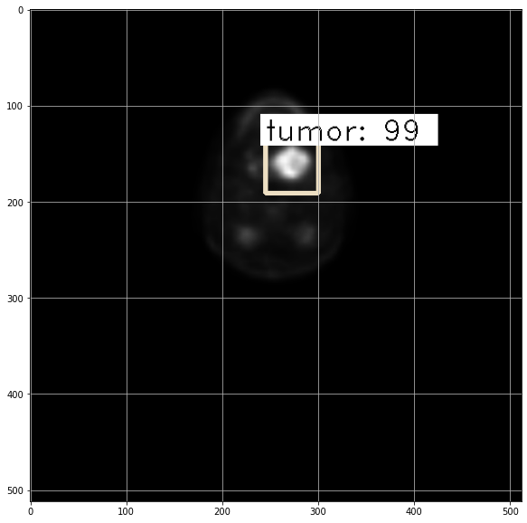

# Faster R-CNN for PET Images by Keras
## Introduction
The original code of Keras version of Faster R-CNN I used was written by yhenon (resource link: GitHub .) He used the PASCAL VOC 2007, 2012, and MS COCO datasets, and finetuned by  RockyXu66. For me, I have used the <a href="https://wiki.cancerimagingarchive.net/display/Public/Head-Neck-PET-CT#9219e971f0494026a216c74aeae636e6"> Head-Neck-PET-CT </a> to extract PET images, and custom trained the network on randomly selected images.

## Project Structure
'data_prep.ipynb' is used to split the data set into testing and training sets and create the annotation files used as input `frcnn_train_vgg.ipynb` is the file to train the model. The configuration and model saved path are inside this file. `frcnn_test_vgg.ipynb` is the file to test the model with test images and calculate the mAP (mean average precision) for the model. If you want to run the code on Colab, you need to give authority to Colab for connecting your Google Drive. Then, you need to upload your annotation file  and training images to the Google Drive and change my path to your right path in the notebook.

## Result a test image

     

